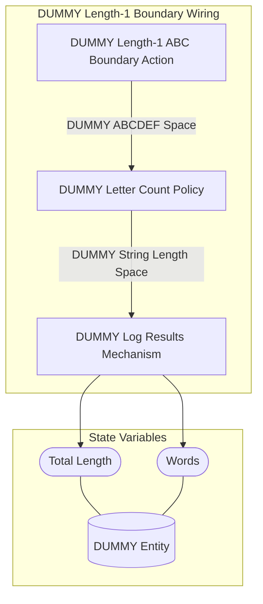
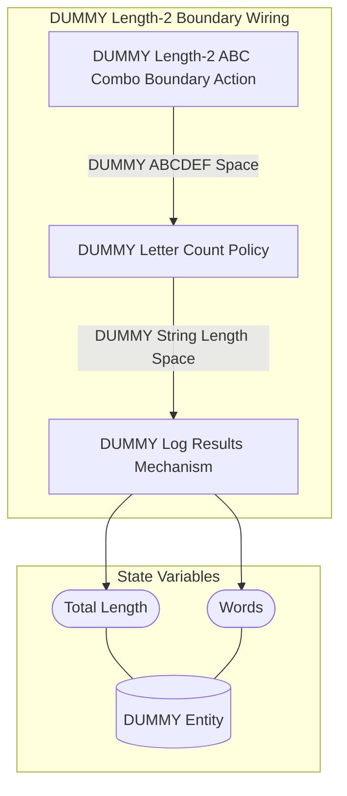
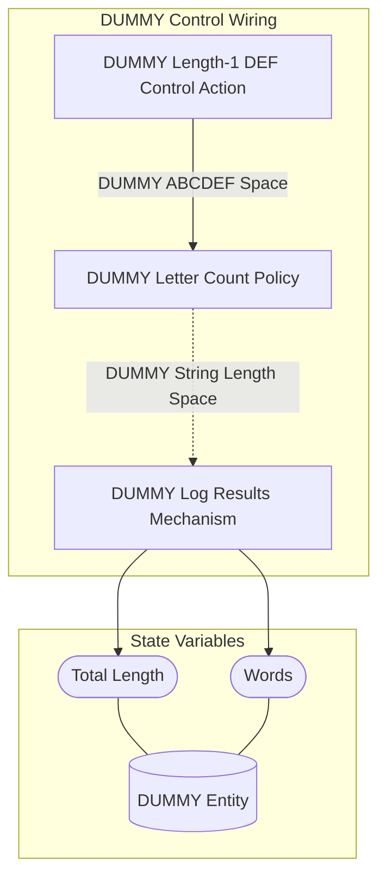

## Wiring Diagrams

## Description

The wirings which are not components of other wirings.
## Wirings
1. [[DUMMY Length-1 Boundary Wiring]]
2. [[DUMMY Length-2 Boundary Wiring]]
3. [[DUMMY Control Wiring]]

## Unique Components Used
1. [[DUMMY Length-1 ABC Boundary Action]]
2. [[DUMMY Length-1 DEF Control Action]]
3. [[DUMMY Length-2 ABC Combo Boundary Action]]
4. [[DUMMY Letter Count Policy]]
5. [[DUMMY Log Results Mechanism]]

## Unique Parameters Used
1. [[DUMMY D Probability]]
2. [[DUMMY Length Multiplier]]

