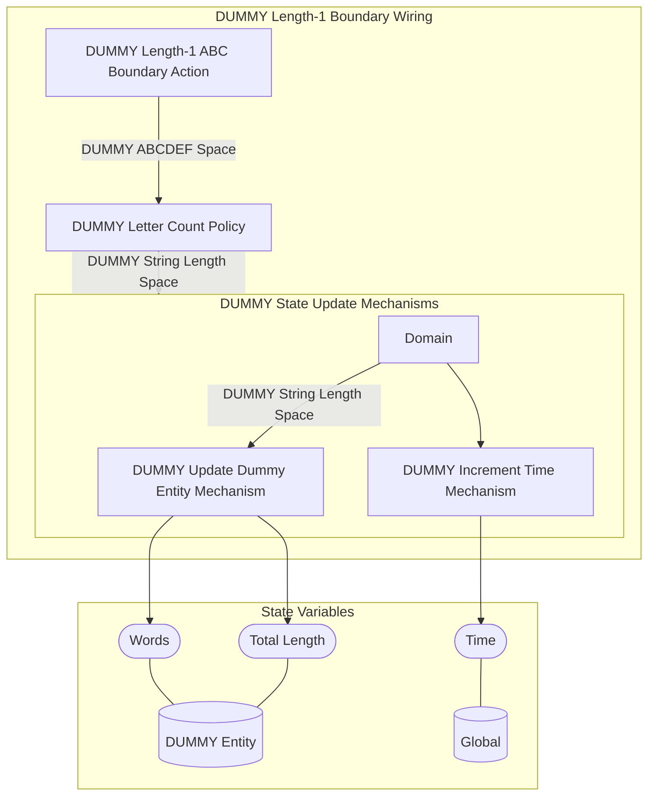
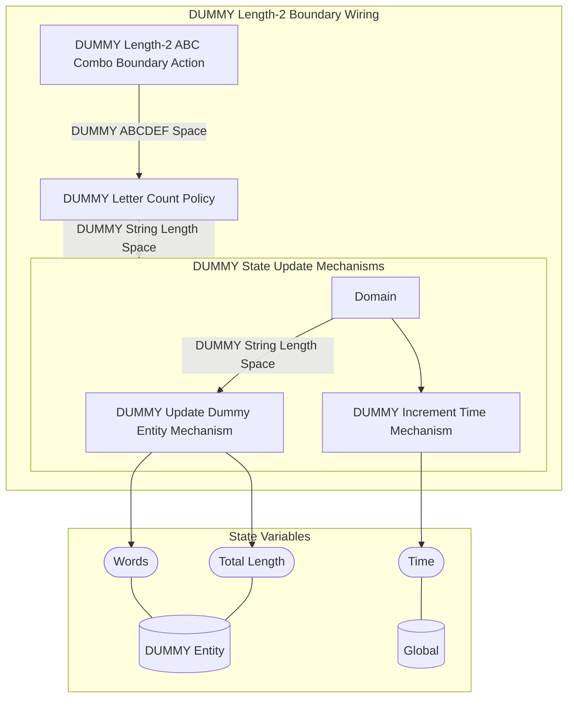

## Wiring Diagrams

## Description

The wirings related to only boundary type actions.
## Wirings
1. [[DUMMY Length-1 Boundary Wiring]]
2. [[DUMMY Length-2 Boundary Wiring]]

## Unique Components Used
1. [[DUMMY Increment Time Mechanism]]
2. [[DUMMY Length-1 ABC Boundary Action]]
3. [[DUMMY Length-2 ABC Combo Boundary Action]]
4. [[DUMMY Letter Count Policy]]
5. [[DUMMY Update Dummy Entity Mechanism]]

## Unique Parameters Used
1. [[DUMMY Length Multiplier]]

