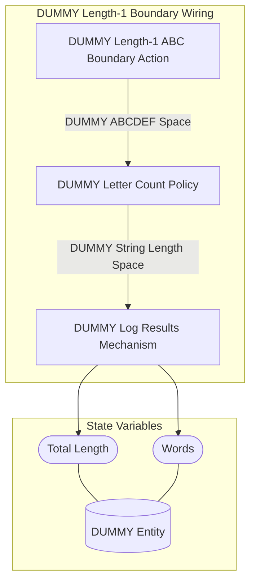

## Wiring Diagram

## Description

Block Type: Stack Block
Dummy Boundary Block
## Components
1. [[DUMMY Length-1 ABC Boundary Action]]
2. [[DUMMY Letter Count Policy]]
3. [[DUMMY Log Results Mechanism]]

## All Blocks
1. [[DUMMY Length-1 ABC Boundary Action]]
2. [[DUMMY Letter Count Policy]]
3. [[DUMMY Log Results Mechanism]]

## Constraints

## Domain Spaces
1. [[Empty Space]]

## Codomain Spaces
1. [[Terminating Space]]

## All Spaces Used
1. [[DUMMY ABCDEF Space]]
2. [[DUMMY String Length Space]]
3. [[Empty Space]]
4. [[Terminating Space]]

## Parameters Used
1. [[DUMMY Length Multiplier]]

## Called By

## Calls

## All State Updates
1. [[DUMMY Entity]].[[DUMMY State-Total Length|Total Length]]
2. [[DUMMY Entity]].[[DUMMY State-Words|Words]]

